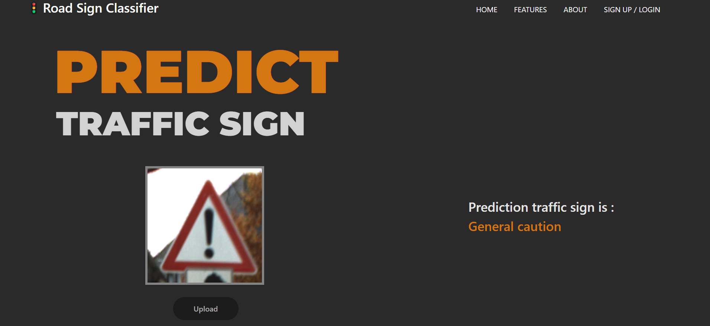
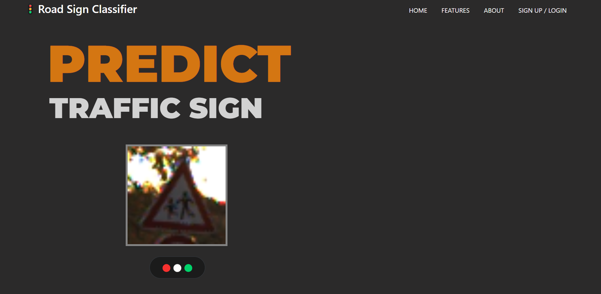
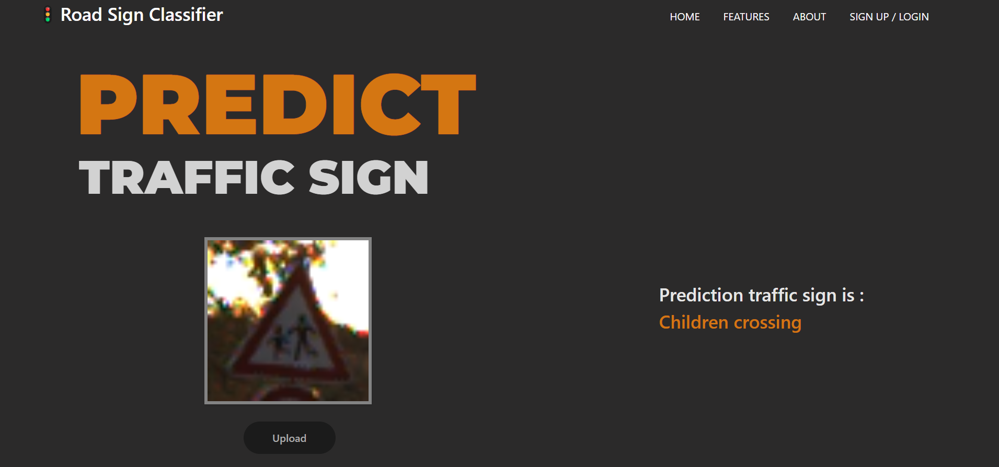

# Road Sign Classifier Python 🚦

A deep learning project that uses Convolutional Neural Networks (CNN) to classify and identify traffic signs in images. This model is trained to recognize various road signs, helping in the development of autonomous driving systems and traffic safety applications.



## 🎯 Features

- Real-time traffic sign classification
- Support for multiple sign categories
- High accuracy using CNN architecture
- Easy-to-use interface for image input
- Detailed prediction confidence scores

## 🖼️ Project Screenshots

### Model Prediction Example


### Training Results


## 🛠️ Technologies Used

- Python 3.8+
- TensorFlow/Keras
- OpenCV
- NumPy
- Matplotlib
- Pandas

## 📊 Dataset

This project uses the [German Traffic Sign Recognition Benchmark (GTSRB)](https://benchmark.ini.rub.de/gtsrb_news.html) dataset, which includes:
- 43 different traffic sign classes
- Over 50,000 images in total
- Various image sizes and lighting conditions

## 🚀 Installation

1. Clone the repository
```bash
git clone https://github.com/RNA62831/Road-Sign-Classifier.git
cd road-sign-classifier
```

2. Create and activate virtual environment (optional but recommended)
```bash
python -m venv venv
source venv/bin/activate  # On Windows use: venv\Scripts\activate
```

3. Install required packages
```bash
pip install -r requirements.txt
```

## 💻 Usage

1. To train the model:
```bash
python train.py
```

2. To predict using a single image:
```bash
python predict.py --image path_to_image.jpg
```

3. To run real-time detection:
```bash
python realtime_detection.py
```

## 📈 Model Architecture

The CNN model consists of:
- Multiple convolutional layers for feature extraction
- Max pooling layers for dimensionality reduction
- Dropout layers to prevent overfitting
- Dense layers for final classification

## 📋 Results

| Metric | Value |
|--------|--------|
| Training Accuracy | 90% |
| Validation Accuracy | 90% |
| Test Accuracy | 88% |


## 🤝 Contributing

1. Fork the repository
2. Create your feature branch (`git checkout -b feature/AmazingFeature`)
3. Commit your changes (`git commit -m 'Add some AmazingFeature'`)
4. Push to the branch (`git push origin feature/AmazingFeature`)
5. Open a Pull Request

## 📝 License

This project is licensed under the MIT License - see the [LICENSE](LICENSE) file for details.

## 👏 Acknowledgments

- German Traffic Sign Recognition Benchmark (GTSRB) dataset team


